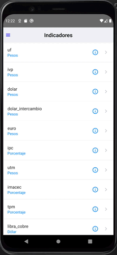
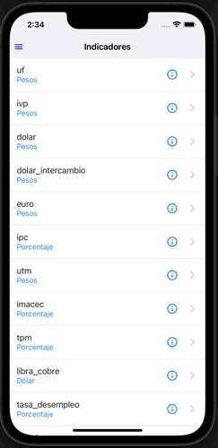

## Configuración y ejecución de la app

<br>

Here I'll show you a quick guide of how to run this app locally:

## Installing the environment

1. [**Android Studio**](https://developer.android.com/studio/install.html)

2. [**Xcode App Store**](https://itunes.apple.com/us/app/xcode/id497799835?mt=12)

3. [**Homebrew**](https://docs.brew.sh/Installation)

**Node & Watchman**

 ```shell
 brew install node
 brew install watchman
 ```

**CocoaPods** 
 ```shell
sudo gem install cocoapods
 ```

**Additional info to install in** [here](https://reactnative.dev/docs/environment-setup)
<br>

## Set node default

The project is running in node version 14.16.1

<br>

## 🚀 Quick start

1.  **Download the repository** 📥

    You can download the repository as zip file or clone it to you computer, with the green button "Code" 🟩 in the top navigation of Github.

2.  **Install dependencies** 🧰

    Once you have it locally, open the terminal, go to the project folder:

    ```shell
    cd path-of-file/folder
    ```
    
    Then run: 
    
    ```shell
    npm install
    ```
    and
    ```shell
    npx pod-install ios
    ```

3. **Run the Project in development mode** 💻

**Run on IOS**
With an emulator opened

```shell
npx react-native run-ios
```

**Run on android**
With an emulator opened or a physical device connected
```shell
npx react-native run-android
```

**List iOS devices**

    ```shell
        $ xcrun simctl list devices
    ```

**List ANDROID devices**

    ```shell
        $ adb devices
    ```
**Node version**
```
v14.16.1
```
**npm version**
```
6.14.3
```
**Java version**
```
openjdk version "1.8.0_275"
OpenJDK Runtime Environment (AdoptOpenJDK)(build 1.8.0_275-b01)
OpenJDK 64-Bit Server VM (AdoptOpenJDK)(build 25.275-b01, mixed mode)
```
## Demo Android


## Demo iOS



